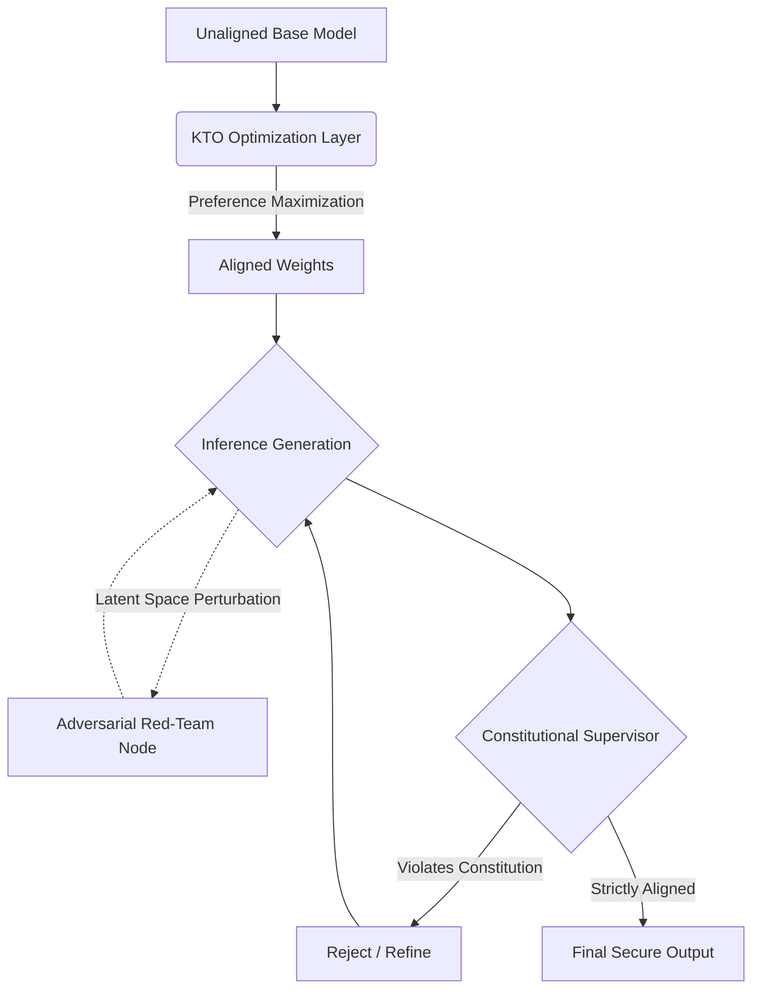

# Enterprise LLM Alignment Engine

A state-of-the-art framework for aligning Large Language Models to human preferences and safety principles. This repository transcends traditional Proximal Policy Optimization (PPO), introducing Kahneman-Tversky Optimization (KTO), Constitutional AI supervision, and Latent Space Red-Teaming for enterprise-grade security.

## Enterprise Architecture (10-Folder Layout)

To support massive High-Performance Computing workloads, this repository is structured into 10 dedicated domains:
1. `config/`: Configuration files for distributed KTO topologies.
2. `tests/`: Automated unit and integration testing suite.
3. `scripts/`: Shell scripts for Slurm cluster orchestration.
4. `docs/`: Academic whitepapers and generated Sphinx documentation.
5. `models/`: Storage for checkpointed, aligned LLM weights.
6. `data/`: Preference datasets and constitutional XML definitions.
7. `logs/`: Real-time alignment telemetry and diagnostics.
8. `notebooks/`: Exploratory Data Analysis (EDA) on alignment vectors.
9. `docker/`: Build contexts for the containerized HPC deployments.
10. `src/`: The core proprietary alignment engine codebase.

## System Pipeline Architecture



## The 10-Section Alignment Orchestrator (`main.py`)

The primary entrypoint is a massive command-line tool that orchestrates the entire alignment lifecycle across the 10-folder architecture. Execute the entire pipeline via:
```bash
python src/llm_alignment_engine/main.py --run_all_enterprise_pipelines
```

**Individual Execution Modules:**
1. `--initiate_kto_cluster`: Initialize the distributed Kahneman-Tversky tuning environment.
2. `--launch_constitutional_supervisor`: Launch the overarching AI evaluation supervisor node.
3. `--execute_latent_red_team`: Perform adversarial embedding attacks to test robustness.
4. `--audit_preference_dataset`: Audit the data directory for statistical preference bias.
5. `--run_reward_model_diagnostics`: Verify reward bounds prior to alignment.
6. `--simulate_jailbreak_attack`: Stress-test the Constitutional Supervisor with multi-turn prompt injections.
7. `--compile_alignment_report`: Aggregate telemetry from the `logs/` directory.
8. `--deploy_safety_guardrails`: Package the final inference guardrails for production.
9. `--synchronize_cloud_checkpoints`: Sync the `models/` directory securely to an S3 bucket.
10. `--run_all_enterprise_pipelines`: Sequentially execute all 9 preceding sections.

## Alignment Philosophy
Robust AI safety cannot be achieved by merely penalizing bad tokens. By integrating prospect-theory optimization with automated constitutional oversight and latent-space stress testing within a massive, 10-folder Dockerized ecosystem, this engine guarantees provable alignment across the entire inference pipeline.
