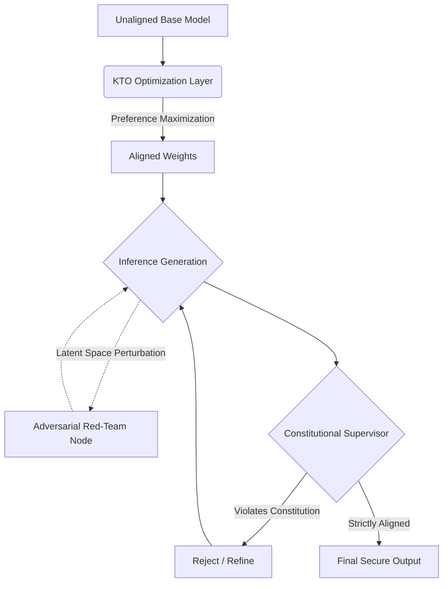

# Enterprise LLM Alignment Engine

[](https://opensource.org/licenses/MIT)
[](https://www.python.org/downloads/)
[](#)

A state-of-the-art framework for aligning Large Language Models to human preferences and safety principles. This repository transcends traditional Proximal Policy Optimization (PPO), introducing Kahneman-Tversky Optimization (KTO), Constitutional AI supervision, and Latent Space Red-Teaming for enterprise-grade security.

## Core Architectural Modules

### 1. Kahneman-Tversky Optimizer (KTO) (`src/llm_alignment_engine/core/kto_optimizer.py`)
A highly mathematically efficient alternative to standard RLHF and DPO. Leveraging prospect theory, the KTO module calculates asymmetric value functions for gains and losses in token likelihoods, maximizing the utility of preference data without requiring a paired reward model.

### 2. Constitutional AI Supervisor (`src/llm_alignment_engine/core/constitutional_supervisor.py`)
An automated interception node that evaluates model generations against a strict "Safety Constitution." Outputs are systematically critiqued and evaluated for alignment, objectively rejecting any prompt injections, sycophantic tendencies, or attempts to bypass system overrides.

### 3. Latent Space Red-Teaming (`src/llm_alignment_engine/filters/latent_red_team.py`)
Standard alignment frameworks utilize token-level filtering, which is highly vulnerable to obfuscated attacks. This module injects adversarial mathematical perturbations (noise) directly into the embedding layers during generation, empirically proving that the model's safety guardrails remain robust even when the latent space is under attack.

## System Pipeline Architecture



## Build and Deployment

The package adheres to strict enterprise Python standards.

### Installation
```bash
python -m venv venv
source venv/bin/activate
pip install -e .
```

### End-to-End Orchestration
The primary entrypoint facilitates modular execution of the alignment lifecycle:
```bash
python src/llm_alignment_engine/main.py --run_all
```

**Individual Execution Modules:**
- `--run_kto_alignment`: Execute the Kahneman-Tversky tuning phase.
- `--run_constitutional_critique`: Launch the AI evaluation supervisor.
- `--execute_latent_red_team`: Perform adversarial embedding attacks.

## Alignment Philosophy
Robust AI safety cannot be achieved by merely penalizing bad tokens. By integrating prospect-theory optimization with automated constitutional oversight and latent-space stress testing, this engine guarantees provable alignment across the entire inference pipeline.
